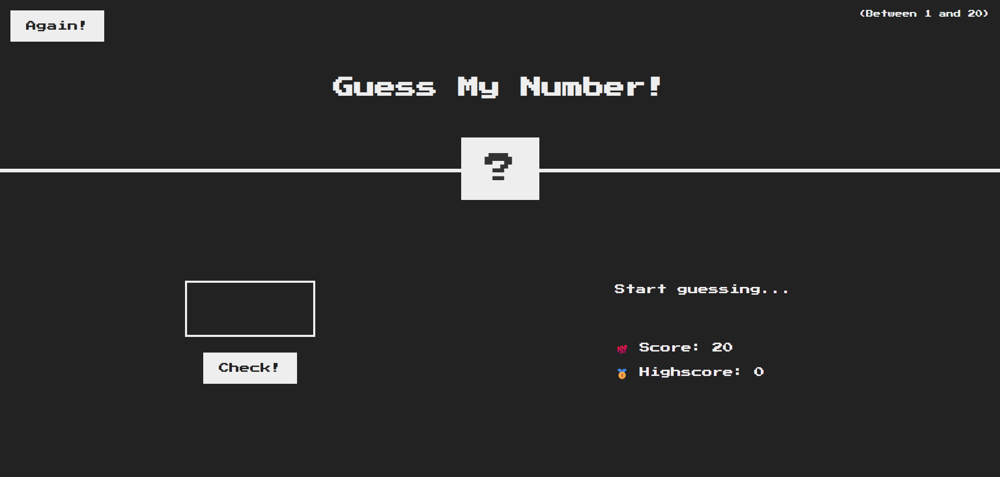
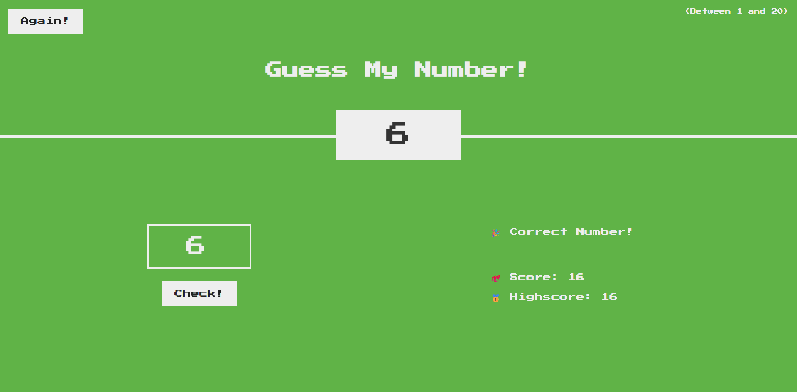
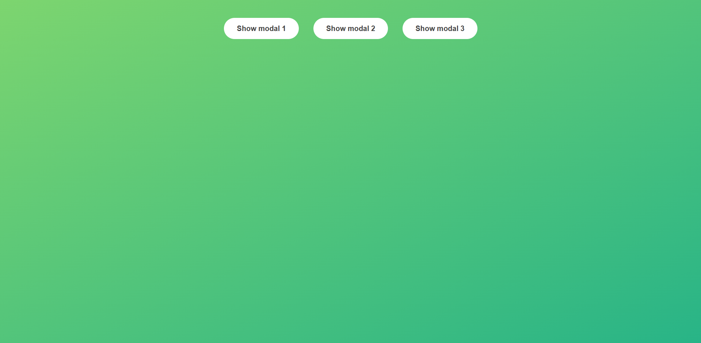
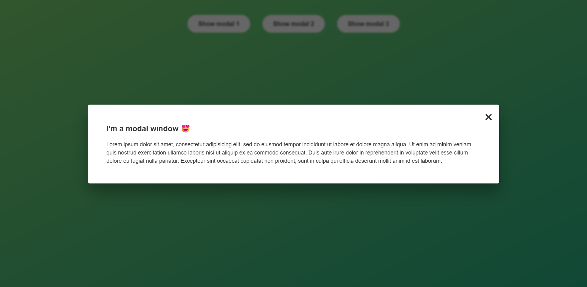
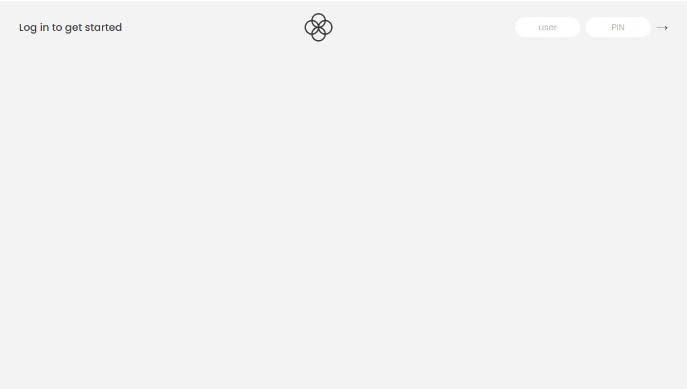
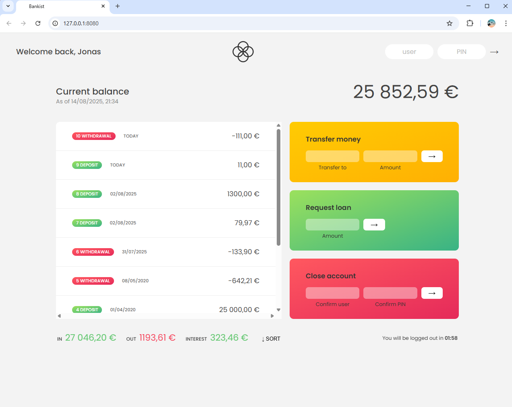

# 🎯 Learning JavaScript by Building
A learning guide covering both basic and advanced concepts of the JavaScript language 📚💻. Supported with code examples and explanations 💡
### 🎮 Project 1: Guess My Number
A fun and interactive number guessing game built with JavaScript.  
It showcases core concepts like:
- `DOM manipulation`
- `Event handling`
- `Conditional logic`
- `DRY principle`

🔢 Try to guess the secret number (between 1–20) with hints provided after each attempt. The game updates the score dynamically and visually responds to correct or wrong guesses.

#### 🗂️ Folder Path 
`starter/04-Guess-My-Number`
#### 🖼️ Game Preview 

  
  

---

### 🪟 Project 2: Modal Window
An interactive modal window built using JavaScript.
It demonstrates essential front-end concepts such as:

DOM selection and manipulation

Event listeners (click, keyboard)

NodeList iteration with for loop

CSS class toggling

Keyboard event handling (Escape key)

✨ The modal can be opened by clicking one of the "Show Modal" buttons, and closed via:

The ❌ close button

Clicking the dark overlay background

Pressing the Escape key on your keyboard

🗂️ Folder Path
starter/06-Modal

🖼️ Modal Preview

  
  

---

### 🏦 Project: Bankist App

A simple and interactive banking application built with JavaScript, HTML, and CSS. It demonstrates key front-end concepts such as:

DOM selection and manipulation

Event listeners (click, form submit)

Array methods (map, filter, reduce)

Timer and automatic logout functionality

Currency and date formatting using Intl API

✨ Features include:

Login/logout system with PIN verification

Display of account balance and transaction history

Transfer money to other accounts

Request loans with automatic approval logic

Close account functionality

Automatic logout after a certain period of inactivity

🖼️ App Preview:

  
  

