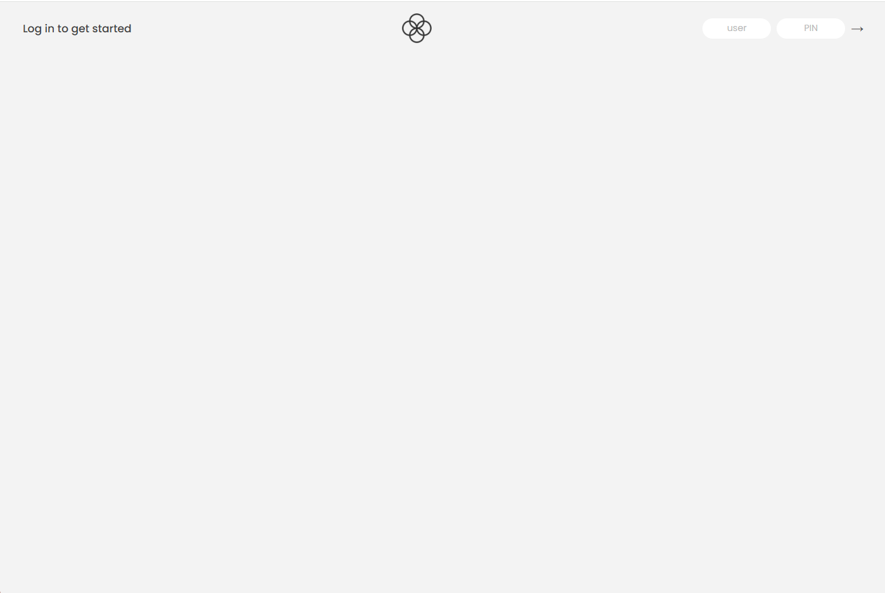
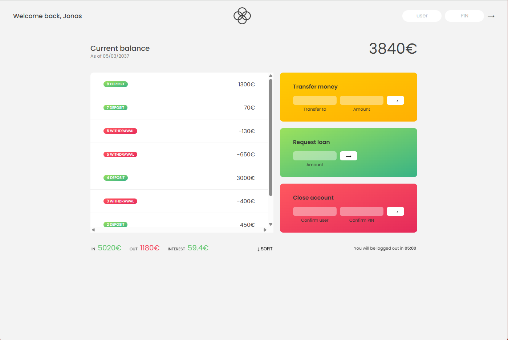
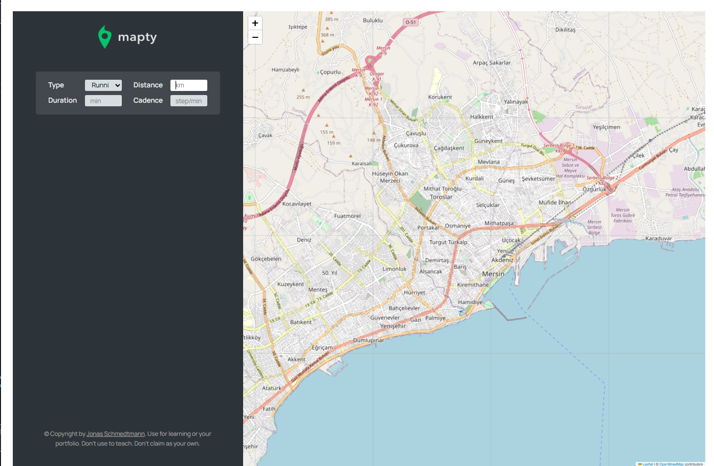
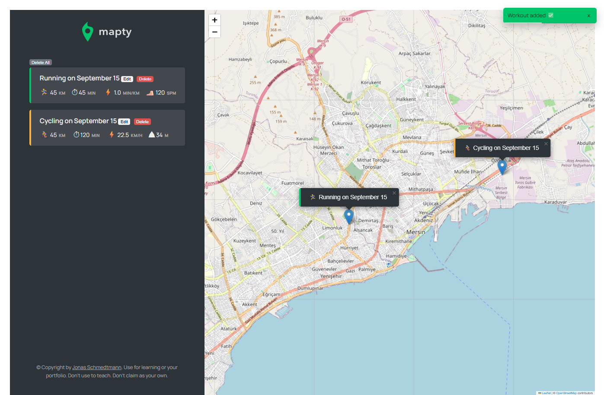
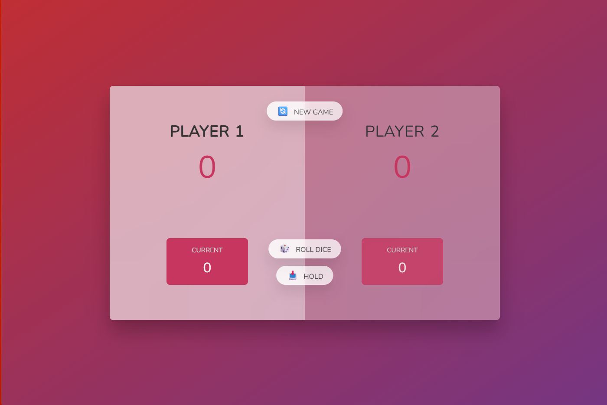
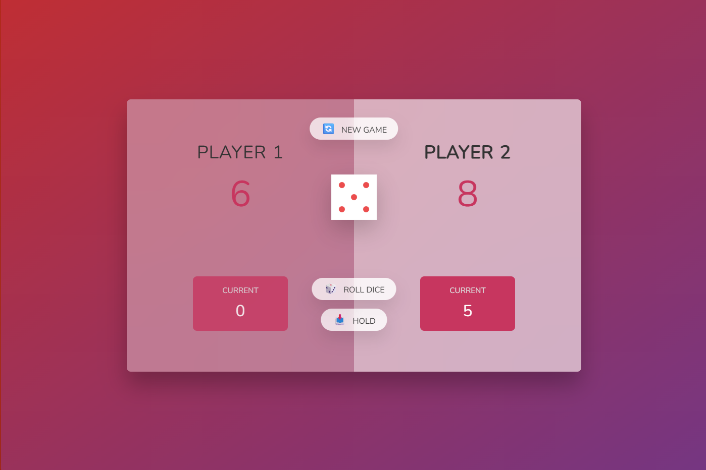
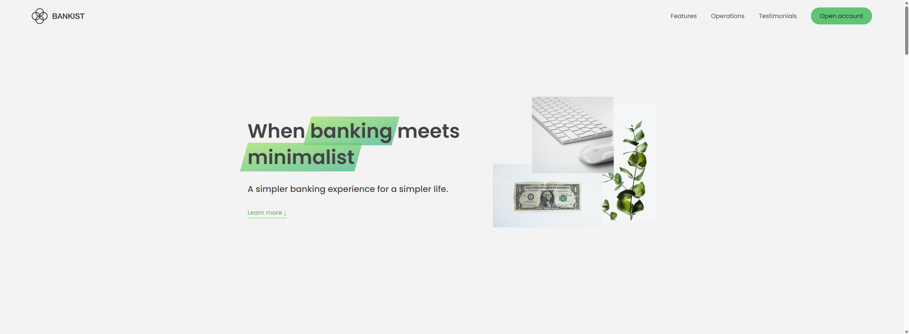
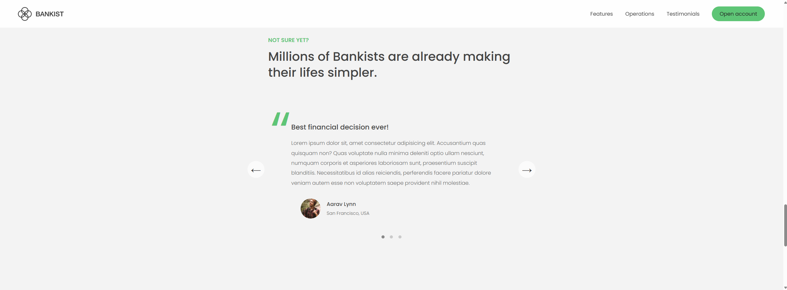

# 🎯 Learning JavaScript by Building
A learning guide covering both basic and advanced concepts of the JavaScript language 📚💻. Supported with code examples and explanations 💡

---

### 🎮 Project 1: Guess My Number
A fun and interactive number guessing game built with JavaScript.  
It showcases core concepts like:
- `DOM manipulation`
- `Event handling`
- `Conditional logic`
- `DRY principle`

🔢 Try to guess the secret number (between 1–20) with hints provided after each attempt. The game updates the score dynamically and visually responds to correct or wrong guesses.

#### 🗂️ Folder Path 
`starter/04-Guess-My-Number`

🌐 **Live Demo**  
[Demo Link](https://ornate-meringue-a2b980.netlify.app)

#### 🖼️ Game Preview 

  
  

---

### 🪟 Project 2: Modal Window
An interactive modal window built using JavaScript.
It demonstrates essential front-end concepts such as:
- DOM selection and manipulation
- Event listeners (click, keyboard)
- NodeList iteration with for loop
- CSS class toggling
- Keyboard event handling (Escape key)

✨ The modal can be opened by clicking one of the "Show Modal" buttons, and closed via:
- The ❌ close button
- Clicking the dark overlay background
- Pressing the Escape key on your keyboard

#### 🗂️ Folder Path
`starter/06-Modal`

#### 🖼️ Modal Preview

  
  

---

### 🏦 Project: Bankist App
A simple and interactive banking application built with JavaScript, HTML, and CSS.  
It demonstrates key front-end concepts such as:
- DOM selection and manipulation
- Event listeners (click, form submit)
- Array methods (map, filter, reduce)
- Timer and automatic logout functionality
- Currency and date formatting using Intl API

✨ Features include:
- Login/logout system with PIN verification
- Display of account balance and transaction history
- Transfer money to other accounts
- Request loans with automatic approval logic
- Close account functionality
- Automatic logout after a certain period of inactivity

#### 🗂️ Folder Path
`starter/Bankist`

🌐 **Live Demo**  
[Demo Link](https://ubiquitous-hotteok-371dbd.netlify.app)

🔑 **Test Credentials**  
Use any of the following demo accounts to log in:
- **User:** `jd` **PIN:** `2222` (Jessica Davis)  
- **User:** `ss` **PIN:** `4444` (Sarah Smith)

#### 🖼️ App Preview

  
  

---

## 🗺️ Project: Mapty App
A workout-tracking web application built with **JavaScript**, **HTML**, **CSS**, and the **Leaflet.js** library.  
It lets users log **running** and **cycling** workouts by clicking on a map and entering workout details.  
Key concepts demonstrated:
- Geolocation API & Leaflet map integration
- DOM selection and dynamic rendering
- Local Storage for persistent data
- Object-oriented JavaScript (classes, inheritance)
- Event handling and form validation

✨ **Features**
- Add running or cycling workouts by clicking any location on the map
- Auto-detect user position and center the map
- View workout stats (distance, duration, pace/speed, elevation, cadence)
- Edit or delete individual workouts, or clear all data
- Persist data between sessions using localStorage

#### 🗂 **Folder Path**
`starter/Mapty/starter`

🌐 **Live Demo**  
[Demo Link](https://jazzy-bombolone-8ef0a9.netlify.app)

#### 🖼 **App Preview**

  
  

---

## 🎲 Project: Pig Game
A classic two-player dice game built with **JavaScript**, **HTML**, and **CSS**.  
Players take turns rolling a dice to accumulate points.  
The first to reach the target score (default 100) wins the game.

### Key Concepts
- DOM selection & manipulation
- Event handling (button clicks & game state updates)
- Game logic & state management
- Conditional rendering and CSS class toggling

### How to Play
1. **Roll Dice**: Add the rolled number to your current score.  
2. **Hold**: Save your current score to your total and pass the turn.  
3. **Roll a 1**: Lose your current score and your turn.  
4. First player to reach 100 points wins!

#### 🗂 **Folder Path**
`starter/Pig-Game`

🌐 **Live Demo**  
[Demo Link](https://charming-cendol-c0e56a.netlify.app)

#### 🖼 **Game Preview**

  
  

---
## 🏦 Bankist Landing Page

A sleek, modern landing page for a fictional digital bank, **Bankist**, built with **HTML**, **CSS**, and **JavaScript**.

**Highlights**
- Minimalist, responsive design with smooth scrolling
- Section reveal animations and lazy-loaded images
- Interactive navigation with sticky header
- Optimized for performance and a clean user experience

📂 **Folder Path**  
`starter/Bankist-landing`

🔗 **Live Demo**  
[View Demo](https://lovely-pastelito-8fdbdc.netlify.app)

🖼 **App Preview**  

  
  

